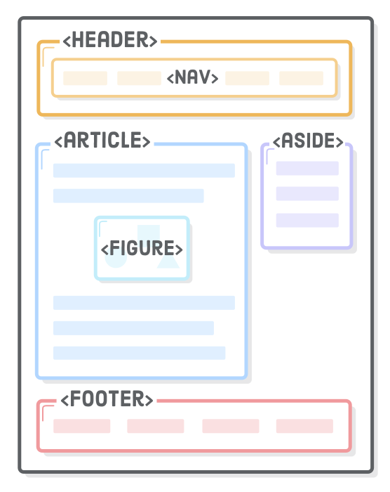
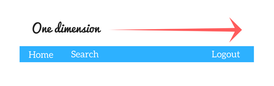
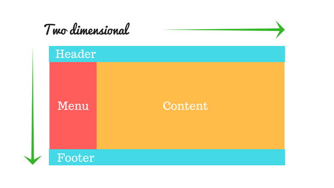

# HTML

## HTML Elements Reference
For more information on HTML elements, see [here](https://developer.mozilla.org/en-US/docs/Web/HTML/Element).

## Accessibility with Headers
For people who are blind or visually impaired, screen reading software is used to parse through text on a web page. A common technique these folks will use to navigate the page is to jump from heading to heading to determine the overall content of the page more easily. That's why it's best practice to not skip one or more heading levels. If you did skip headings and went from <h1> to <h3>, you may cause confusion since the user has to deal with a missing heading. Don't bum out any of your users - structure your headings properly!

## Spans
The HTML `<span>` element is like a generic wrapper that is used to group text, mostly for styling purposes.
``` 
<style>
p {
  color: black;
}
.red {
  color: red;
}
</style>
<p>
  This sentence needs some <span class=”red”>visual emphasis</span> to really bring home the point.
</p>
```

## Attributes
Attributes provide additional information about an element, and are always specified in the start tag. Attributes usually come in name/value pairs like `name="value"`. e.g. An image’s alternative text (often a description for those with accessibility needs) is provided through the `alt` attribute.

## Self-Closing Tags
Because they don’t have a closing tag and consequently can’t contain anything inside them, self-enclosing elements usually carry a few attributes, to provide them with additional information.

Here are some examples:
* Line Break: <br /> 
* Image: 
* Form Input: <input />

## Links
The “HyperText” part of HTML defines what kind of links we use: hypertext links, a.k.a hyperlinks.
The `href` attribute (hypertext reference) is used to define the destination of the link.

3 types of destinations you can define:
* anchor targets, to navigate within the same page
* relative URLs, usually to navigate within the same website
* absolute URLs, usually to navigate to another website

You can also use additional attributes besides `a` and `href`:
* Specify the relationship between the current and linked document with the rel attribute
* Specify where to open the linked document with the target attribute

In the example below, we are setting the URL destination to The Labrador Club website, preventing this website from being able to access the window.opener property and ensuring it runs in a separate process with the noopener rel value. Finally we are requesting that the link open in a new window instead of the same one with the `_blank` target value.

```
<a href="https://thelabradorclub.com" rel="noopener" target="_blank"
  >Join The Labrador Retriever Club</a>
```

## Metadata
The `<head>` element contains the metadata for a web page.
Metadata is information about the page that isn’t displayed directly on the web page. Unlike the information inside of the `<body>` tag, the metadata in the head is information about the page itself.

Learn more about the `<meta>` element [here](https://developer.mozilla.org/en-US/docs/Web/HTML/Element/meta)

### Title
A browser’s tab displays the title specified in the `<title>` tag. The `<title>` tag is always inside of the `<head>`.
```
<!DOCTYPE html>
<html>
  <head>
    <title>My Coding Journal</title>
  </head>
</html>
```

## Hierarchy
HTML is organized as a collection of family tree relationships. Understanding HTML hierarchy is important because child elements can inherit behavior and styling from their parent element.

## Semantic Elements
Structure elements allow you to organize the main parts of your page. They usually contain other HTML elements.

Here’s what a typical webpage could include:
* `<header>` as the first element of the page, that can include the logo and the tagline.
* `<nav>` as a list of links that go to the different pages of the website.
* `<h1>` as the title of the page.
* `<article>` as the main content of the page, like a blog post.
* `<footer>` as the last element of the page, located at the bottom.



# CSS

## Pseudo-Classes
A CSS pseudo-class is a keyword added to a selector that specifies a special state of the selected element(s). For example, :hover can be used to change a button's color when the user's pointer hovers over it.

```
selector:pseudo-class {
  property: value;
}
```

For more information on pseudo-classes and to see an Index of Standard Pseudo-Classes, see the Mozilla Dev Docs [here](https://developer.mozilla.org/en-US/docs/Web/CSS/Pseudo-classes).

## Attributes
Attribute selectors are a special kind of selector that will match elements based on their attributes and attribute values.

Their generic syntax consists of square brackets ([]) containing an attribute name followed by an optional condition to match against the value of the attribute.

Attribute selectors can be divided into two categories depending on the way they match attribute values:

Presence and value attribute selectors and
Substring value attribute selectors.
These attribute selectors try to match an exact attribute value:

`[attr]` This selector will select all elements with the attribute attr, whatever its value.
`[attr=val]` This selector will select all elements with the attribute attr, but only if its value is val.
`[attr~=val]` This selector will select all elements with the attribute attr, but only if val is one of a space-separated list of words contained in attr's value. (This one is a bit more complex, so checking some [documentation](https://developer.mozilla.org/en-US/docs/Web/CSS/Attribute_selectors) might be helpful.)

We can select multiple HTML elements in the same CSS rule by separating them with commas. Add this to our styles.css file:

```
h1, h2, h3, h4, h5, h6 {
  font-family: "Helvetica", "Arial", sans-serif;
}
```

## Linking CSS

### Inline
To style an HTML element, you can add the style attribute directly to the opening tag. After you add the attribute, you can set it equal to the CSS style(s) you’d like applied to that element.
`<p style="color: red; font-size: 20px;">I'm learning to code!</p>`

### Style Tag 
To use the `<style>` element, it must be placed inside of the `<head>` element.
```
<head>
  <style>
    p {
      color: red;
      font-size: 20px;
    }
  </style>
</head>
```

### External Stylesheet
The `<link>` element must be placed within the head of the HTML file. It is a self-closing tag and requires the following three attributes:

* `href` — like the anchor element, the value of this attribute must be the address, or path, to the CSS file.
* `type` — this attribute describes the type of document that you are linking to (in this case, a CSS file). The value of this attribute should be set to text/css.
* `rel` — this attribute describes the relationship between the HTML file and the CSS file. *Note* that in HTML5, you *don’t have to specify type="text/css"* here.

Example:
`<link href="https://udacity.com/style.css" type="text/css" rel="stylesheet" />`

If the CSS file is stored in the same directory as your HTML file, then you can specify a relative path instead of a URL, like so:
`<link href="./style.css" type="text/css" rel="stylesheet" />`

Using a relative path is very common way of linking a stylesheet.

## Specificity

In order of precedence:
1. `!important`
2. Id Selectors (`#unique`)
3. Class Selectors (`.warning`) 
4. Type Selectors (`h1`) and Pseudo-Elements (`::before`)


## The Box Model
Every element in web design is a rectangular box.
According to the box model concept, every element on a page is a rectangular box and may have width, height, padding, borders, and margins.

*Padding*
Padding - The space between the box’s content and its border. Note that padding is in addition to the content’s height and width, and is considered to be inside the element itself.

*Border*
Border - A line drawn around the content and padding of an element. 
1. Define the stroke width of the border
2. Define its style
3. Define its color

When you’re not sure how a box is being rendered, add a border: 1px solid red; declaration to it. This will clearly show the box’s padding, margin, and overall dimensions with just a single line of CSS.

Want see every single "box" that makes up a page? Try putting this in the stylesheet temporarily:
```
* {
  border: 1px solid red !important;
}
```

*Margin*
It is the space between the box and surrounding boxes.

### Box Model Components
;


## CSS Display Property
* `display: inline` - No width and height because it just occupies the space it takes up with its text content.
* `display: inline-block` - Similar to inline, except you can add width and height. 
* `display: block` -  Takes up its entire line no matter what.
* `display: none` - Nothing is displayed. Takes up no width and height from the DOM - It doesn't disrupt the flow of other elements.

### Display and Positioning: Inline & Block
The biggest distinction between outside display options is whether elements occupy the entire horizontal line they are on (remember that elements are organized hierarchically on the DOM) or if they only occupy the width they need and then the following element can be placed next to them on the same horizontal line.

Elements set to inline display have no width or height and only occupy the space that their text property (or .innerHTML property) takes up. So in our box class example above, the rectangles would display on the same line but only occupy as much space as their text needs to display.

## Display and Positioning: Z-index
Overlapping elements with a larger z-index cover those with a smaller one.
Without explicitly using z-index the last element written to the DOM (the last element you wrote in your code) will appear on top of all the others, and so on up the chain of your elements.

## Absolute vs Relative Units
Many CSS properties require a unit of measurement. There’s a lot of units available, but the most common ones you’ll encounter are px (pixel) and em (pronounced like the letter m). The former is what you would intuitively call a pixel, regardless of whether the user has a retina display or not, and the latter is the *current font size of the element* in question.

There are broadly two types of units of measurement for CSS properties, absolute and relative.

### Absolute - Static
* px
* in
* mm
* cm

Absolute measurements are set values regardless of anything having to do with your program or the browser. A font size set to 16px will appear the same size no matter how big the screen. 

### Relative - Dynamic
* % - percentage of something, such as screen width
* em - A unit equivalent to the current font size - if 12px font, 2em would be 24px
* vw - units of viewport width (essentially the browser’s rendering space). Each unit is 1/100th of width
* vh - the same as above but for viewport height

The em unit is very useful for *defining sizes relative to some base font*. For example, if you set the font-size of body to 16px, you could then set other element’s font-size value relative to that 16px. Here’s what that could look like:
```
body {
 font-size: 16px;
}

#one {
  font-size: 1.5em
}

#two {
  font-size: 0.5em
}
```

## Fonts

### Font Family
font-family is another built-in CSS property that defines the typeface for whatever element you selected. It accepts multiple values because not all users will have the same fonts installed.

When using fonts on the web, you must first consider what fonts are available to your users. Every operating system, be it Windows, OS X, or Linux, comes with a set of pre-installed fonts that you can use for customizing your website. For a complete list of "web-safe" fonts, follow [this](https://web.mit.edu/jmorzins/www/fonts.html) link.

1. When using the font-family property, you specify the font(s) you want to use in your HTML.
2. The browser, starting from left to right, looks at the font(s) you've specified and checks to see if it can render the text using the font(s) you've provided. 
3. If it can't use the first font, then the browser moves to the next font, and so-on.

The purpose for specifying multiple fonts is because not all fonts are available on every operating system. So, specifying multiple, similar fonts ensures users have a consistent experience regardless of the operating system they are using.

### Font Weight & Style
In CSS, font weights are expressed as numeric values between 100 and 900. Fortunately, there are relatively standardized, human-friendly terms for each of these numeric values. “Black” usually means 900, “bold” is 700, “regular” is 400, etc. Most families don’t supply a face for every single weight. For example, Roboto is missing “extra light” (200), “semi bold” (600), and “extra bold” (800).

### Additional Resources:
Check out [CSS Tricks](https://css-tricks.com/).

## Flexbox
Specializes in alligning and distributing elements within a parent element.

* Flex Container - Can expand to fit the items available inside of it. Uses a main container with items nested inside of it where some of the CSS properties are used only for the parent and others on the items.
* `Flex Container` - Parent | `Flex Items` - Elements inside.
* To use flexbox set the `display` property of a `div` to `flex`. The items inside that element will automatically become flex items, and you can then use the flexbox syntax in your CSS code.

By setting an element's display property to flex, all elements inside of it become flex items that can be laid out in a customized way following design patterns like columns, rows, alignment, and distribution.

More info [here](https://developer.mozilla.org/en-US/docs/Learn/CSS/CSS_layout/Flexbox) on Flexbox.

### Axes and Direction with Flexbox
The Flexbox model relies on two axes: the *main axis* and the *cross axis*. *The main axis is defined by flex-direction*, which has four possible values:
* `row`
* `row-reverse`
* `column`
* `column-reverse`

*The two row settings will create the main axis horizontally* - or `inline` direction. *The two column settings will create the main axis vertically* - or `block` direction.

The axis determines the flow of your content - you can think of this as being either rows or columns - and they will be determined when you start aligning and justifying content within a flex container.

Read more about the [Basic Concepts of Flexbox](https://developer.mozilla.org/en-US/docs/Web/CSS/CSS_Flexible_Box_Layout/Basic_Concepts_of_Flexbox#The_two_axes_of_flexbox).

### Main Axis - flex-direction: row:

### Main Axis - flex-direction: column:

### Cross Axis - flex-direction: row:

### Cross Axis - flex-direction: column:


### Ordering Elements with Flexbox
There are three ways to explicitly set the order in which items will appear in a grid:
1. Moving the HTML code for the elements themselves to reorder
2. Appending -reverse to row or column will reverse the order in the specified row or column
3. Using the order property of the individual items inside the grid

### Alligning Items and Justifying Content with Flexbox
To align items on the *cross axis* use `align-items` with the possible values:
* `stretch`
* `flex-start`
* `flex-end`
* `center`

To justify content on the *main axis* use `justify-content`, which has the possible values:
* `flex-start`
* `flex-end`
* `center`
* `space-around`
* `space-between`
* `space-evenly`

## Flexbox Fundamentals
The Flexbox Layout model emphasizes presenting a more methodological way to lay out, align and allocate space among items in a container, even when their size is unknown and/or dynamic (thus the word “flex”).

“The main idea behind the flex layout is to give the container the ability to alter its items’ width/height (and order) to best fill the available space (mostly to accommodate to all kind of display devices and screen sizes).”



* A flex container expands its items to fill available free space or shrinks them to prevent overflow. 
* It provides a better arrangement of all of the page elements. 
* It is a one-dimensional layout model that offers space allocation between items in an interface and robust alignment capabilities.

## Grid Fundamentals
CSS Grid Layout is a CSS layout method developed for the two-dimensional layout of items on a webpage or an application, meaning it can manage both columns and rows.

CSS Grid outshines at dividing a page into several sections or defining the correlation in terms of size, position, and layer.



## Grid VS Flexbox
At the highest level *CSS Grid excels at creating layouts for a webpage*, while *Flexbox is a master of content flow for each element* that makes up the page layout.


### Overview
* CSS Grid Layout is a two-dimensional system, meaning it can handle both columns and rows, unlike flexbox which is largely a one-dimensional system (either in a column or a row).
* CSS Grid’s approach is layout-first while Flexbox’ approach is content-first.
* If you are well aware of your content before making layout, then blindly opt for Flexbox and if not, opt for CSS Grid.
* Flexbox layout is most appropriate to the components of an application (as most of them are fundamentally linear), and small-scale layouts, while the Grid layout is intended for larger scale layouts which aren’t linear in their design.
* If you only need to define a layout as a row or a column, then you probably need flexbox. If you want to define a grid and fit content into it in two dimensions — you need the grid.


## Grid Rows and Coulmns
To use CSS Grid set the `display` property of the container element to `grid`.

After setting the display property of your container div to grid, the next step is to set the rows and columns in your grid which can be done with the CSS properties:
* `grid-template-columns`
* `grid-template-rows`
* To define gutters between rows and columns you can use the property `grid-gap` on the parent container that has the display property set to grid.

## Rows & Columns in Action
`grid-template-columns` is the property that defines the column layout of your grid - that is how many sections the page should be divided into vertically. The values for this property are the explicit value for each column and the number of columns is defined implicitly by the number of values entered. For example:

`grid-template-columns: 60px 60px;`
would create two columns of 60px each. If you had two items inside your grid and didn't set their position explicitly, the first item would be placed in the first column and the second item in the second. grid-template-rows follows the same logic, so that:
`grid-template-columns: 60px 60px;`
`grid-template-rows: 160px 60px;`
would create a grid with two columns and two rows.

A CSS Grid is made up of rows and columns which are defined using the CSS properties `grid-template-columns` and `grid-template-rows`, which take as values the size of each track.

See [grid visualizer and generator](https://cssgrid-generator.netlify.com/).


## Grid Areas
The grid-area property defines the space an element takes up in the grid by setting values for the row it starts and ends in, and the column it starts and ends in. In practice it could look like this:
```
  #one { 
    /* row start/column start/ row end/ column end */
    grid-area: 1/2/3/3;
  }
```
In this example the element with the id, one would start at the first row and the first column, and end at the third row (which is the end of the second row if there is no third row) and the third column.

Because `grid-area` is shorthand for the properties: `grid-row-start`, `grid-column-start`, `grid-row-end` and `grid-column-end`, the code above places the item from rows 1-3, and columns 2-3.

Grid Areas Summary
grid-template-areas is the property used to name the rows and columns of a grid and to set its layout. It could look like this:
```
  .container {
      display:grid;
      grid-template-columns: 300px 300px 300px;
      grid-template-rows: 250px 600px;
      grid-template-areas: 
      "hd hd hd hd hd hd hd hd"
      "sd sd sd main main main main main"
      "ft ft ft ft ft ft ft ft";
  }
```
The named areas in the grid are then assigned to each element according to where you want them to be displayed in the grid:
```
.header {
  grid-area: hd;
}
```
## Advanced Grid
In the example above the element with the class header will stretch across the entire first row of columns because we have assigned it the grid-area hd, and we have defined the area hd with the value for grid-template-areas in the parent element.

Advanced Grid Recap
The fr unit represents a fraction of the available space in the grid container.
*Note* `grid-template-rows: 350px 350px 1fr` = `container-height` - `grid-gap`

The repeat() notation can be used to quickly layout many tracks for large grids. For example:

`grid-template-columns: 1fr 1fr 1fr 1fr 1fr 1fr 1fr;`
Could be written with repeat notation like this:

`grid-template-columns: repeat(7, 1fr);`
The grid-auto-rows property can be used to generate the number of rows based on the content and available space. The following code:

`grid-auto-rows: minmax(100px, auto);`
Would create rows that are at least 100px tall and can be as tall as the content inside them demands.


### Tip
The following will adjust for tall letters for example and is ideal for `X` amount of Rows of Content. 
*Note* `grid-auto-rows: minmax(100px, auto);`


## Grid - A Simple Blog Page
*Note* When adding an image to a grid commponent, consider using `background-image: (url)` and `background-size: contain` instead as this will respect the set size of the element.

### Key Terms
`breakpoints` - the viewport width at which we want our design to change.
`viewport` - the area of the window in which web content can be seen. We use the dimensions of the viewport (usually the width, but sometimes the height) as the basis of our media queries.

## Adding Media Queries in Code
Media queries are used to set different style rules for different devices or sized screens. We use breakpoints to set the condition of a media query. The logic is: `@media(feature:value)`

Here is an example of how that could look in action:
```
@media(min-width:900px) {
  body{
   background:red;
 }
}
```
In the above example, if the viewport width is greater than 900px the background of the webpage would turn red.

## Multiple Breakpoints
We have seen how to set a breakpoint and use Media Queries to create different layouts for smaller screens and larger screens, but there are some development moments that will call for 3 possible layouts.

Here is an example of what that code could look like:
```
/* Anything smaller than first breakpoint 600px */
.container {
  // rules for small screen
}

/* Medium Screens */
@media (min-width: 600px) and (max-width:900px) {
  .container {
    // rules for medium-sized screen
  }
}

/* Large Screens */
@media (min-width:901px) {
  .container {
    // rules for large screen
  }
}
```
In this example, the medium screens media query is new, and we use the keyword and to build a complex media query that evaluates both a min and max to create a range for the CSS rules to apply, in this case if the width of the viewport is between 600px-900px.

Complex media queries can be built using the keyword and to bound CSS rules between a range using min-width and max-width.

## Building Responsive Layouts with Flexbox & Grid
Nesting CSS grids is simple and can be done simply by using the display:grid rule for both a parent and child element.

Here is how that could look with real code:
```
.container {
  display:grid;
  // ...
}

#one {
  display:grid
}
```

